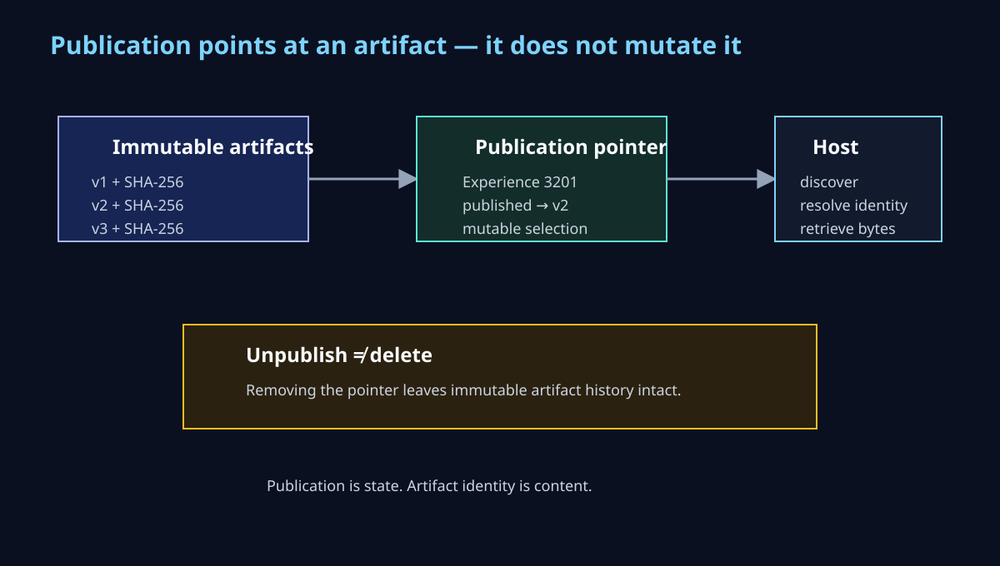

# The Singularity Workshop — MicroBundle Repository

**The durable artifact boundary for MicroBundles.**


The visual separates three responsibilities that should remain independently replaceable: artifact delivery, artifact interpretation, and runtime composition.

This repository stores and delivers versioned MicroBundle artifacts. It deliberately does not become a database, composition engine, arbitration engine, Experience host, or GUI.

## The boundary

~~~text
Experience / published manifest
          |
          v
   local bundle cache
          |
          | missing artifact
          v
IMicroBundleRepository
          |
          v
Azure Blob Storage
          |
          v
 verified artifact bytes
          |
          v
 composition host
          |
          v
       FSM_COS
   dependency closure
   load once
   arbitration
   convergence
          |
          v
   RuntimeAssembly
~~~

The architectural invariant is simple:

> **Blob Storage is the substrate. The repository is the delivery boundary. FSM_COS is the composition boundary.**

## Artifact identity

An artifact is addressed by three values:

~~~text
MicroBundle ID
      +
explicit version
      +
SHA-256 content identity
~~~

The physical Azure location is deterministic:

~~~text
microbundles/
└── artifacts/
    └── {bundleId}/
        └── {version}/
            └── {sha256}.bundle
~~~

No database lookup is required to locate a complete artifact address.

The repository verifies the SHA-256 before materializing the immutable artifact object. Storage metadata repeats the identity for inspection, but the bytes remain authoritative.

## Projects

~~~text
src/
├── Core/
│   └── TheSingularityWorkshop.MicroBundleRepository.Core
│       └── platform-neutral contracts and artifact identity
└── Azure/
    └── TheSingularityWorkshop.MicroBundleRepository.Azure
        └── Azure Blob Storage implementation

tests/
├── Core/
│   └── deterministic artifact identity tests
└── Azure/
    └── deterministic Azure path/configuration tests
~~~

### Core

`TheSingularityWorkshop.MicroBundleRepository.Core` has no Azure dependency.

Its central contract is:

~~~csharp
public interface IMicroBundleRepository
{
    ValueTask<MicroBundleArtifact?> GetAsync(
        MicroBundleArtifactAddress address,
        CancellationToken cancellationToken = default);

    ValueTask PutAsync(
        MicroBundleArtifact artifact,
        CancellationToken cancellationToken = default);
}
~~~

### Azure

`TheSingularityWorkshop.MicroBundleRepository.Azure` uses the Microsoft Azure SDK and `DefaultAzureCredential`.

That means the storage account key does not belong in application configuration or source control. Local development can authenticate through Visual Studio or Azure CLI; Azure-hosted applications can later use managed identity without changing the repository contract.

## Azure configuration

The first deployment target is intentionally minimal:

- StorageV2
- Standard performance
- LRS redundancy
- Hot access tier
- one private `microbundles` container
- public blob access disabled
- secure transfer enabled
- TLS 1.2 minimum
- no database
- no CDN
- no Front Door
- no geo-replication

See [Azure setup](docs/AZURE_SETUP.md) for the portal and CLI configuration.

See [architecture](docs/ARCHITECTURE.md) for the full repository boundary.

## What this repository does not do

It does not:

- discover semantic dependencies
- resolve MicroBundle dependency graphs
- arbitrate installed bundles
- construct RuntimeAssembly
- own Experience composition
- host WebForge, Unity, MyVR, or another presentation surface
- provide general-purpose CRUD/query persistence

Those boundaries matter.

The repository does not define a MicroBundle executable format. A composition host may choose a representation such as a compiled assembly wrapped in a binary envelope. That representation is interpreted only after the repository has returned verified opaque bytes.

~~~text
MicroBundle assembly
      ↓
FSM_Serialization envelope
      ↓
SHA-256 artifact identity
      ↓
Azure Blob Storage
      ↓
verified bytes
      ↓
composition-side materializer
      ↓
IMicroBundle
~~~

The repository answers:

> **Given this complete MicroBundle artifact address, where are its bytes and can I verify them?**

The composition host answers:

> **How do I interpret those bytes and bind them into runtime MicroBundles?**

FSM_COS answers:

> **Given the requested MicroBundles, how do I compose and arbitrate them into a RuntimeAssembly?**

## Development

Build and test the explicit solution rather than relying on folder inference:

~~~powershell
dotnet restore TheSingularityWorkshop.MicroBundleRepository.slnx
dotnet build TheSingularityWorkshop.MicroBundleRepository.slnx --configuration Release
dotnet test TheSingularityWorkshop.MicroBundleRepository.slnx --configuration Release
~~~

The Azure integration test path will be added once the real development storage account is provisioned; the current test suite intentionally has no hidden dependency on a live cloud resource.

## Why Blob Storage first?

MicroBundles are artifacts.

A repository should be able to move an artifact from durable storage to a resident/local cache without introducing a query engine between the request and the bytes.

That gives us the shape we want:

~~~text
artifact address
      ↓
deterministic blob location
      ↓
bytes
      ↓
SHA-256 verification
      ↓
local/resident cache
      ↓
FSM_COS
~~~

Storage can evolve later. The composition contract does not need to know that it was Azure today.


## Experience discovery and publication state



The Experience artifact repository is immutable. Publication is a separate pointer that identifies which immutable artifact is currently live.

The REST host exposes the first discovery path for hosts such as AnyApp:

```text
GET /api/experiences
GET /api/experiences/{experienceId}
GET /api/experiences/{experienceId}/{version}/{sha256}
```

The discovery endpoint returns only published artifact identity. It does not deserialize or execute the Experience. The selected artifact bytes remain the host/Experience boundary's responsibility.


~~~text
experiences/
├── artifacts/{experienceId}/{version}/{sha256}.experience
└── publications/{experienceId}.publication.json
~~~

The publication lifecycle is:

~~~text
publish v1
    ↓
publication → v1
    ↓ modify
publication → v2
    ↓ unpublish
no publication
~~~

`IExperienceCatalog` owns that pointer. Unpublishing removes the pointer; it does not delete the immutable artifact bytes. This keeps artifact identity, publication state, and FSM_COS composition as separate boundaries.

~~~csharp
public interface IExperienceCatalog
{
    ValueTask<ExperiencePublication?> GetPublishedAsync(...);
    ValueTask PublishAsync(ExperiencePublication publication, ...);
    ValueTask UnpublishAsync(ulong experienceId, ...);
}
~~~

That gives an Experience a durable path from definition to consumption:

~~~text
Experience definition
       ↓
serialize
       ↓
immutable artifact
       ↓
Azure Blob Storage
       ↓
publication pointer
       ↓
FSM_COS
       ↓
RuntimeAssembly
~~~
