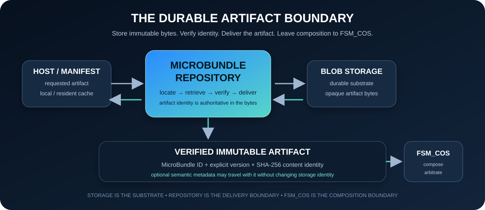
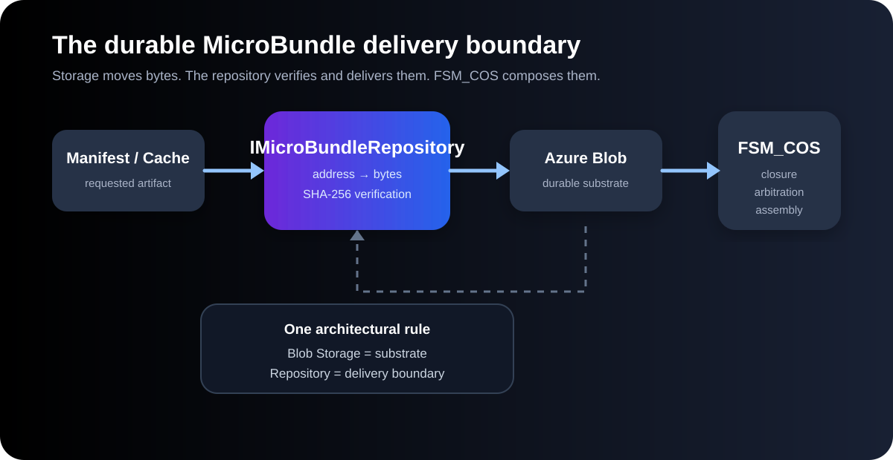
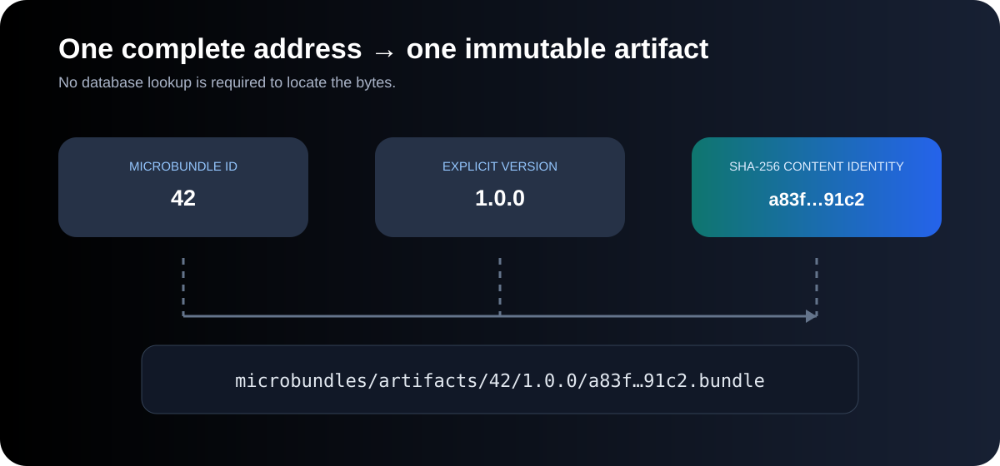
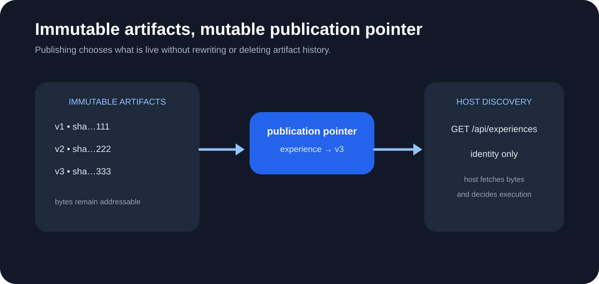

# The Singularity Workshop — MicroBundle Repository

  

  <strong>Where MicroBundles live before they become runtime.</strong> 
  <em>Locate the artifact. Verify the bytes. Deliver the capability. Stop there.</em>

> **The repository is the durable artifact boundary — not the composition engine, not the database, and not the host.**

---

## If you only have a minute

A MicroBundle has three very different questions around it:

| Question | Boundary |
|---|---|
| **What is this capability?** | [MicroBundleDomain](https://github.com/TrentBest/TheSingularityWorkshop.MicroBundleDomain) |
| **Where do I get this complete artifact?** | **MicroBundleRepository** |
| **How do I compose it with other capabilities?** | [FSM_COS](https://github.com/TrentBest/TheSingularityWorkshop.FSM_COS) |

The repository answers exactly one of those questions:

> **Given a complete artifact address, where are its bytes, and can I verify that they are the bytes I asked for?**

That sounds narrow.

It is intentionally narrow.

A repository that starts resolving semantic dependencies, arbitrating capabilities, executing Experiences, or learning application-specific meaning has crossed the boundary into somebody else's job.

---

## The mental model

Think of the repository as a **warehouse door**, not the warehouse's business logic.

A host requests a complete artifact:

~~~
MicroBundle ID
     +
explicit version
     +
SHA-256 content identity
~~~

The repository locates the corresponding bytes, verifies their identity, and returns an immutable artifact.

Then it gets out of the way.

~~~
request
   |
   v
repository
   |
   +--> locate
   +--> retrieve
   +--> verify
   |
   v
verified artifact
   |
   v
composition / host
~~~

---

# 1. What the repository actually owns

The repository owns the **delivery boundary for complete MicroBundle artifacts**.

That includes:

- artifact identity;
- explicit artifact versions;
- content identity;
- deterministic storage locations;
- durable artifact retrieval;
- integrity verification;
- artifact materialization;
- optional artifact metadata that does not change storage identity.

It does **not** own:

- MicroBundle domain semantics;
- dependency-graph resolution;
- arbitration;
- RuntimeAssembly construction;
- Experience execution;
- GUI rendering;
- application scheduling;
- renderer behavior;
- a universal database/query model.

The architectural invariant is:

> **Blob Storage is the substrate. The repository is the delivery boundary. FSM_COS is the composition boundary.**

---

# 2. Artifact identity is not storage identity

An artifact is identified by three pieces of information:

~~~
                    immutable identity
                          |
          +---------------+---------------+
          |               |               |
     MicroBundle ID   explicit version   SHA-256
~~~

The physical Azure location is deterministic:

~~~
microbundles/
└── artifacts/
    └── {bundleId}/
        └── {version}/
            └── {sha256}.bundle
~~~

There is deliberately no database lookup required to construct the complete artifact location.

The repository verifies the SHA-256 before materializing the immutable artifact object.

**The bytes remain authoritative.**

Storage metadata can repeat identity for inspection, but metadata does not get to redefine the content.

---

# 3. The artifact lifecycle

A MicroBundle moves through the system like this:

~~~
authoring / publication
          |
          v
   complete artifact
          |
          v
    content identity
          |
          v
   durable Blob Storage
          |
          v
 IMicroBundleRepository
          |
          v
 verified immutable bytes
          |
          v
 composition-side materializer
          |
          v
       IMicroBundle
          |
          v
       FSM_COS
          |
          v
    RuntimeAssembly
~~~

The repository does not deserialize a MicroBundle into application behavior merely because it can store bytes.

The first concrete payload format is a compiled MicroBundle assembly wrapped in a small domain-owned binary envelope supplied through [FSM_Serialization](https://github.com/TrentBest/TheSingularityWorkshop.FSM_Serialization).

The repository still treats that payload as an artifact:

~~~
MicroBundle assembly
       |
       v
FSM_Serialization envelope
       |
       v
SHA-256 artifact identity
       |
       v
Azure Blob Storage
       |
       v
verified bytes
       |
       v
composition-side materializer
       |
       v
IMicroBundle
~~~

That keeps representation, storage, and composition separate.

---

# 4. Where this fits in the Workshop

The repository sits between the domain contract and the composition runtime without becoming either one.

~~~
                    MICRO BUNDLE
                         |
                         v
              +----------------------+
              |   MicroBundleDomain  |
              |        WHAT          |
              +----------+-----------+
                         |
                    artifact
                         |
                         v
              +----------------------+
              | MicroBundleRepository|
              |       WHERE          |
              +----------+-----------+
                         |
                  verified bytes
                         |
                         v
              +----------------------+
              |       FSM_COS        |
              |        HOW           |
              +----------+-----------+
                         |
                         v
                 RuntimeAssembly
                         |
             +-----------+-----------+
             |           |           |
             v           v           v
           AnyApp     WebPage      MyVR
~~~

These are boundaries, not a demand that every application use the entire Workshop.

A developer can implement their own repository.

A developer can implement another composition host.

A developer can use MicroBundleDomain without using this repository at all.

The packages meet through contracts.

---

# 5. Core: the platform-neutral contract

TheSingularityWorkshop.MicroBundleRepository.Core contains the platform-neutral repository contract and artifact identity model.

It has no Azure dependency.

The central repository contract is intentionally small:

~~~csharp
public interface IMicroBundleRepository
{
    ValueTask<MicroBundleArtifact?> GetAsync(
        MicroBundleArtifactAddress address,
        CancellationToken cancellationToken = default);

    ValueTask PutAsync(
        MicroBundleArtifact artifact,
        CancellationToken cancellationToken = default);
}
~~~

The implementation behind that interface may be:

- Azure Blob Storage;
- an in-memory repository;
- a local development store;
- a future object store;
- another durable artifact system.

The composition boundary should not need to know which one was selected.

---

# 6. Azure: the first durable substrate

TheSingularityWorkshop.MicroBundleRepository.Azure provides the first concrete storage implementation.

It uses the Microsoft Azure SDK and DefaultAzureCredential.

That means application configuration does not need to contain a storage account key.

Local development can authenticate through Visual Studio or Azure CLI. An Azure-hosted application can later use managed identity without changing the repository contract.

The initial storage target is intentionally boring:

- StorageV2
- Standard performance
- LRS redundancy
- Hot access tier
- one private microbundles container
- public blob access disabled
- secure transfer enabled
- TLS 1.2 minimum
- no database
- no CDN
- no Front Door
- no geo-replication

See [Azure setup](docs/AZURE_SETUP.md) for the deployment details.

> **Azure is the first substrate, not the architectural boundary.**

---

# 7. Optional semantic metadata

The artifact's **storage identity does not become semantic identity**.

An artifact may carry optional semantic ontology metadata:

~~~
content identity
      |
      +----> storage identity
      |
      +----> optional semantic address
~~~

That allows a consumer to associate an artifact with an ontology-defined meaning without forcing the repository to understand that ontology.

For example:

~~~
artifact
  |
  +-- BundleId / version / SHA-256
  |
  +-- optional semantic address
          |
          v
ontology://.../life/animal/fish/locomotion/swim
~~~

The repository stores and transports that metadata.

It does not turn into an ontology engine.

This is the same architectural principle used elsewhere in the Workshop:

> **Optional structure should remain optional.**

---

# 8. Experience artifacts are immutable too

Experiences use the same separation between **immutable artifact identity** and **mutable publication state**.

The repository can therefore contain:

~~~
experiences/
├── artifacts/{experienceId}/{version}/{sha256}.experience
└── publications/{experienceId}.publication.json
~~~

The artifact is immutable.

The publication pointer can change.

~~~
publish v1
    |
    v
publication --> v1

modify / publish v2
    |
    v
publication --> v2

unpublish
    |
    v
no publication
~~~

Unpublishing removes the pointer; it does not require deleting the immutable artifact.

That distinction lets discovery change without changing artifact identity.

---

# 9. REST discovery is a catalog boundary

The REST host provides the first discovery surface for hosts such as AnyApp.

The initial shape is:

~~~http
GET /api/experiences
GET /api/experiences/{experienceId}
GET /api/experiences/{experienceId}/{version}/{sha256}
~~~

The discovery endpoint returns artifact identity and publication information.

It does not:

- execute the Experience;
- become the Experience host;
- silently construct RuntimeAssembly;
- redefine the artifact bytes.

The selected bytes remain the responsibility of the host/composition side.

That gives us:

~~~
REST
 |
 | "which artifact is published?"
 v
publication identity
 |
 v
repository
 |
 | "give me these verified bytes"
 v
artifact
 |
 v
composition
~~~

---

# 10. What this repository deliberately does not do

This is one of the most important sections of the repository.

### It does not resolve dependencies

If Bundle A requires Bundle B, the repository can deliver both artifacts.

It does not decide that A's dependency graph is valid.

That is a composition concern.

### It does not arbitrate

Arbitration exists because capabilities can change the composition when they encounter one another.

That belongs to [FSM_COS](https://github.com/TrentBest/TheSingularityWorkshop.FSM_COS).

### It does not own semantic meaning

An ontology may describe what an artifact means.

The repository can carry that association.

It does not become the ontology.

### It does not become a general-purpose database

The repository is optimized around complete artifact identity and delivery.

It is not intended to become:

~~~
SELECT * FROM everything
WHERE application-specific-condition = ...
~~~

The repository should move bytes reliably.

Higher layers decide what those bytes mean.

---

# 11. Why Blob Storage first?

MicroBundles are artifacts.

A repository should be able to move an artifact from durable storage to a resident/local cache without inserting a query engine between the request and the bytes.

The desired path is:

~~~
artifact address
      |
      v
deterministic blob location
      |
      v
bytes
      |
      v
SHA-256 verification
      |
      v
local / resident cache
      |
      v
FSM_COS
~~~

This gives the system a useful property:

> **Storage can evolve without forcing the composition contract to evolve with it.**

Azure is the current implementation.

The contract is the architecture.

---

# 12. Repository structure

~~~
TheSingularityWorkshop.MicroBundleRepository/
|
├── src/
│   ├── Core/
│   │   └── TheSingularityWorkshop.MicroBundleRepository.Core
│   │       ├── repository contracts
│   │       ├── artifact identity
│   │       └── optional semantic metadata
│   │
│   └── Azure/
│       └── TheSingularityWorkshop.MicroBundleRepository.Azure
│           └── Azure Blob Storage implementation
│
├── tests/
│   ├── Core/
│   │   └── deterministic artifact identity tests
│   └── Azure/
│       └── deterministic storage/configuration tests
│
├── docs/
│   ├── ARCHITECTURE.md
│   ├── AZURE_SETUP.md
│   └── images/
│
└── README.md
~~~

The repository is intentionally split so the platform-neutral contract does not inherit the Azure implementation.

---

# 13. Development

Build and test the explicit solution rather than relying on folder inference:

~~~powershell
dotnet restore TheSingularityWorkshop.MicroBundleRepository.slnx

dotnet build TheSingularityWorkshop.MicroBundleRepository.slnx --configuration Release

dotnet test TheSingularityWorkshop.MicroBundleRepository.slnx --configuration Release
~~~

The current test suite intentionally has no hidden dependency on a live cloud resource.

The Azure integration path can be added when the development storage environment is provisioned.

---

# 14. Documentation map

The README is the **map**.

The linked documents are the **rooms**.

| I want to understand... | Read |
|---|---|
| The repository boundary | [Architecture](docs/ARCHITECTURE.md) |
| Azure deployment | [Azure Setup](docs/AZURE_SETUP.md) |
| The MicroBundle contract | [MicroBundleDomain](https://github.com/TrentBest/TheSingularityWorkshop.MicroBundleDomain) |
| Composition and arbitration | [FSM_COS](https://github.com/TrentBest/TheSingularityWorkshop.FSM_COS) |
| Binary artifact representation | [FSM_Serialization](https://github.com/TrentBest/TheSingularityWorkshop.FSM_Serialization) |
| Semantic addressing | [Ontology](https://github.com/TrentBest/TheSingularityWorkshop.Ontology) |
| Package | [NuGet](https://www.nuget.org/packages/TheSingularityWorkshop.MicroBundleRepository) |
| Source | [GitHub](https://github.com/TrentBest/TheSingularityWorkshop.MicroBundleRepository) |

The README answers:

> **What is this, why does it exist, and where does it stop?**

The architecture documents answer:

> **How is the boundary implemented?**

The source answers:

> **Exactly what does the code do?**

---

# 15. The boundary in one picture

The entire repository can be reduced to this:

~~~
                    WHERE
                     |
                     v
              MicroBundleRepository
                     |
          +----------+----------+
          |                     |
       locate                verify
          |                     |
          +----------+----------+
                     |
                     v
             immutable bytes
                     |
                     v
                   HOW
                     |
                     v
                 FSM_COS
~~~

Or, in one sentence:

> **MicroBundleDomain defines what a capability is. MicroBundleRepository delivers its artifact. FSM_COS determines how capabilities become a runtime composition.**

That separation is the point.

---

## Resources

- **GitHub:** https://github.com/TrentBest/TheSingularityWorkshop.MicroBundleRepository
- **NuGet:** https://www.nuget.org/packages/TheSingularityWorkshop.MicroBundleRepository
- **Architecture:** [docs/ARCHITECTURE.md](docs/ARCHITECTURE.md)
- **Azure Setup:** [docs/AZURE_SETUP.md](docs/AZURE_SETUP.md)
- **MicroBundleDomain:** https://github.com/TrentBest/TheSingularityWorkshop.MicroBundleDomain
- **FSM_COS:** https://github.com/TrentBest/TheSingularityWorkshop.FSM_COS
- **FSM_Serialization:** https://github.com/TrentBest/TheSingularityWorkshop.FSM_Serialization
- **Ontology:** https://github.com/TrentBest/TheSingularityWorkshop.Ontology

---

  

  <em>The Singularity Workshop — Tools for the curious, the bold, and the systemically inclined.</em> 
  <strong>Because state shouldn't be a mess.</strong>

