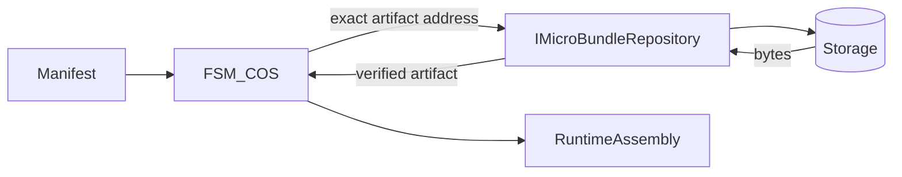
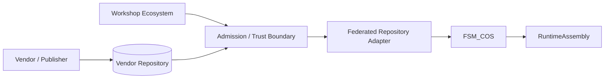
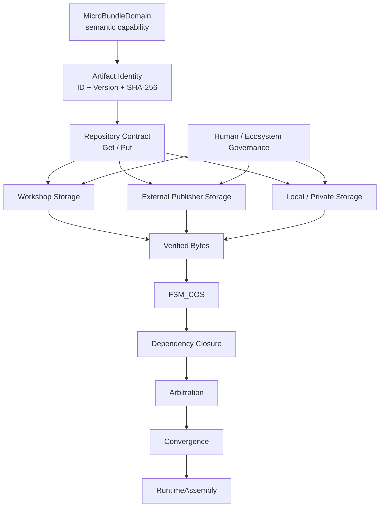

# MicroBundle Repository Theory

## 1. The question this package answers

A MicroBundle repository exists because **capability identity and physical storage are different problems**.

A MicroBundle may be authored, compiled, licensed, hosted, cached, admitted, composed, and executed by different systems. The repository boundary exists between those concerns.

The Core question is:

> **Given an exact MicroBundle artifact identity, how do we obtain bytes that can be independently verified without requiring the composition system to understand the storage substrate?**

The repository is not the MicroBundle domain model, not the composition engine, and not the governance system.

## 2. Three identities

```text
SEMANTIC IDENTITY
    MicroBundleId
    Version
         |
         v
CONTENT IDENTITY
    SHA-256(bytes)
         |
         v
PHYSICAL LOCATION
    storage-provider-specific key
```

The semantic identity answers **what version of a capability was requested**.

The content identity answers **which exact bytes are present**.

The physical location answers **where those bytes happen to live today**.

The physical location is therefore replaceable. The content identity is not.

## 3. The repository is a delivery boundary



**FSM_COS asks for an exact artifact.**

It does not ask the repository which bundles are interesting, what dependencies exist, how arbitration should work, what GUI should be shown, which Experience should win, or how a runtime assembly should be constructed.

## 4. Why content addressing matters

An artifact address contains:

```text
(bundle ID, version, SHA-256)
```

The hash is calculated from the complete artifact bytes.

```text
same address
    |
    +--> same bytes
    |
    +--> independently verifiable
```

If storage returns different bytes for that address, Core rejects the artifact.

> **A repository may change where an artifact is stored, but it cannot silently change what that artifact means.**

## 5. Immutability and publication are different things

```text
IMMUTABLE ARTIFACTS

    v1 ────────────────┐
    v2 ────────────────┼──> durable history
    v3 ────────────────┘

PUBLICATION

    "current" ─────────────> v3
```

An immutable artifact is a historical fact. A publication pointer is a current choice.

Changing the publication pointer does not rewrite v1, v2, or v3.

## 6. Extrinsic hosting: repositories can live outside the Workshop



The vendor remains the custodian of its artifacts.

The Workshop ecosystem can remain the custodian of its **admission decision**.

Those are deliberately different authorities.

## 7. Entanglement without ownership

“Extrinsic” does not mean “unrelated.”

An external repository can be entangled with the ecosystem through explicit relationships:

- admitted repository identity;
- artifact addresses referenced by manifests;
- publisher or organization metadata;
- capability/ontology metadata;
- licensing information;
- trust or admission records;
- Experience composition references.

None of those require the Workshop to become the owner of the external bytes.

```text
                 THE SINGULARITY WORKSHOP
                           |
                  admission / trust
                           |
             +-------------+-------------+
             |             |             |
             v             v             v
        Workshop       Vendor A       Vendor B
        Repository     Repository     Repository
             |             |             |
             +-------------+-------------+
                           |
                  exact artifact identity
                           |
                           v
                        FSM_COS
                           |
                           v
                    RuntimeAssembly
```

> **Interoperability does not imply ownership.**

## 8. How federation should work

Federation belongs above the primitive repository contract.

A federated implementation can itself implement:

```csharp
IMicroBundleRepository
```

Its internal job is:

```text
exact address
     |
     v
admission table
     |
     +--> Workshop repository
     |
     +--> Vendor A repository
     |
     +--> Vendor B repository
     |
     v
selected source
     |
     v
verified MicroBundleArtifact
```

The adapter should not invent a second artifact identity.

It should preserve the complete address and let Core verify the returned bytes.

> **A federation gateway is a repository implementation, not a new kind of MicroBundle.**

That means FSM_COS does not need a special vendor-bundle path.

## 9. Admission is not discovery

**Discovery** answers: “What repositories or artifacts exist?”

**Admission** answers: “Which repositories is this ecosystem willing to use?”

**Authorization** answers: “Who may perform this operation?”

**Licensing** answers: “Under what terms may this capability be used?”

Core does not answer those questions.

Core supplies the artifact contract on which those higher-level systems can operate.

## 10. Repository topology is independent of composition

A single Experience might use:

```text
Workshop Core Repository
       +
Publisher Repository
       +
Research Institution Repository
       +
Local Development Repository
       |
       v
   FSM_COS
       |
       v
RuntimeAssembly
```

Composition should care about **artifact identity and admitted availability**, not whether bytes came from one storage account or four organizations.

## 11. Caching does not change identity

```text
repository
    |
    v
verified bytes
    |
    v
cache
    |
    v
FSM_COS
```

A cache may accelerate delivery. It does not become authoritative over artifact identity.

## 12. Domain, repository, composition, and governance

| Layer | Question |
|---|---|
| MicroBundleDomain | **What is this capability?** |
| Repository.Core | **Which exact artifact bytes are these?** |
| FSM_COS | **How do these capabilities compose?** |
| Governance / admission | **Which sources are allowed to participate?** |

Experience systems then add:

> **How should the resulting composition be presented and experienced?**

## 13. Repository theory in one picture



The picture is intentionally asymmetric:

- Domain defines meaning.
- Repository defines artifact delivery.
- Storage holds bytes.
- Governance controls participation.
- FSM_COS composes capabilities.

## 14. Design consequences

### Portable
The Core contract does not require Azure.

### Federated
External organizations can host artifacts without surrendering custody.

### Verifiable
Returned bytes are checked against content identity.

### Reproducible
An exact artifact address identifies exact bytes.

### Cache-friendly
Caches are delivery accelerators rather than authorities.

### Governance-compatible
Admission can be controlled without embedding policy in Core.

### Composition-neutral
FSM_COS can consume an admitted artifact regardless of its physical host.

## 15. The boundary we should protect

> **Do not make the repository smarter merely because the ecosystem is getting smarter.**

When a new requirement arrives, first ask which boundary owns it.

If it is about bytes and artifact identity, it belongs in Repository.Core.

If it is about storage, it belongs in a repository implementation.

If it is about which repositories may participate, it belongs in governance/admission.

If it is about dependencies and arbitration, it belongs in FSM_COS.

If it is about the human experience, it belongs in the Experience layer.

That discipline is what allows an ecosystem of independently operated repositories to remain composable.